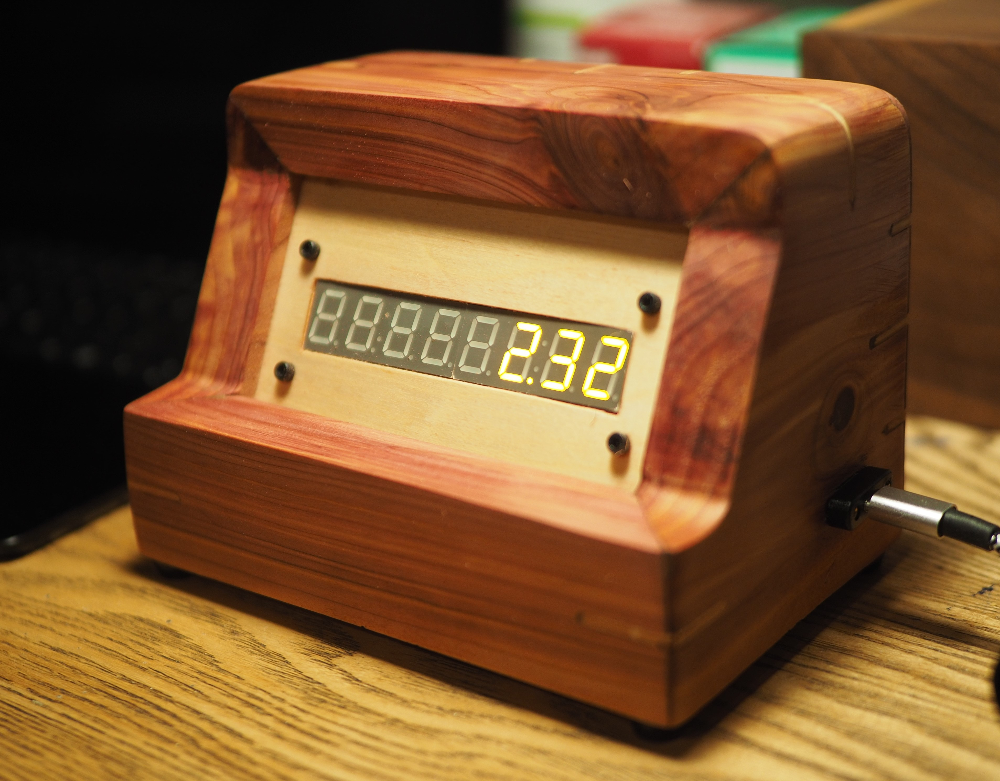

# azure-spend-iot-display

This is a simple project guide for a nifty little Raspberri Pi desk toy that displays your current Azure consumption on two HT16K33 7-segment displays. Amaze all your friends and colleagues with a constant reminder of your profligate cloud hosting spending!



## Prerequisites
- A Raspberry Pi. You can probably get away with one as old as v2.
- A computer with .NET Core sdk installed. You'll be compiling .NET Core code and publishing it to your pretty little Raspberry Pi.
- 2x 7-segment displays w/ HT16K33 driver backpack. You can get these from Adafruit and various other retailers.
- Jumpers or wires and a breadboard/stripboard and so on.
- Optional: CNC and 3D printer if you plan to fabricate one using the contents of the `/src/Enclosure` directory.

## Pi Setup
- Burn a fresh Raspberry Pi with a fresh Raspbian or similar installed. As always, change the default username and password. For reals.
- Setup `wpa-supplicant` with your WiFi's SSID and password
- Enable ssh (adding a file called `ssh`  on the boot is all that's necessary)
- SSH into the Pi and enable I2C support with `raspi-config`
```
Interface Options -> I2C - Yes
```
- Create your Azure service principal for querying the Azure management api. For this example we are using `consumption-display` as our service principal name.
    - This is easy to do in Azure CLI. E.g.: 
    ```
    create-for-rbac -n consumption-display
    ```
    - This will produce an output like the one below. Guard this information as though it were a precious treasure.
    ```
  "appId": "00000000-0000-0000-0000-000000000000",
  "displayName": "consumption-display",
  "password": "PASSWORD",
  "tenant": "00000000-0000-0000-0000-000000000000"
  ```
    - You will also have to log into the Azure portal and grand read access to this service principle on the subscription. Subscriptions -> Access Control -> Add Role Assignment, etc. Know what you are doing.
- SSH into your Pi and install the .NET Core framework
    ```
    curl -sSL https://dot.net/v1/dotnet-install.sh | bash /dev/stdin --channel Current
    ```
- And then the following:
    ```
    echo 'export DOTNET_ROOT=$HOME/.dotnet' >> ~/.bashrc
    echo 'export PATH=$PATH:$HOME/.dotnet' >> ~/.bashrc
    source ~/.bashrc
    ```

## Build & Deploy!
- On your desktop, or whatever, navigate to the repo's `/src/AzureConsumptionDisplay.App` directory and create an `appsettings.local.json` and add the following config substituting the config values specific to your service principal:
    ```
    {
        "AZURE_APP_ID": "<Your service principal app id>",
        "AZURE_APP_PASSWORD": "<Your app password>",
        "AZURE_APP_TENANT": "<Your app tenant>",
        "AZURE_SUBSCRIPTION_ID": "<your app subscription id>"
    }
    ```
- Build and publish the app with the command running in the `src/AzureConsumptionDisplay.App` dir:
    ```
    dotnet publish --runtime linux-arm --self-contained
    ```
- Deploy the app using `scp` or similar sftp client like so:
    ```
    scp -r ./bin/debug/net6.0/linux-arm/publish/* [YOUR PI LOGIN]@[YOUR PI IP]:/home/[YOUR PI LOGIN]]/azure-consumption-display/ 
    ```
    - You may need to create the destination directory first
- SSH into your Pi and set up a cronjob for this bad boy with `crontab -e`.
```
*/5 * * * * /home/[YOUR USERNAME]/.dotnet/dotnet /home/[YOUR USERNAME]/azure-consumption-display/AzureConsumptionDisplay.App.dll >/home/[YOUR USERNAME]/azure-consumption-display-log 2>&1

@reboot /home/[YOUR USERNAME]/.dotnet/dotnet /home/[YOUR USERNAME]/azure-consumption-display/AzureConsumptionDisplay.App.dll >/home/[YOUR USERNAME]/azure-consumption-display-log 2>&1
```

## Hardware - Wiring
- Note that the left seven-seg display uses an address of 114 (0x72). On the typical backpack, this means the middle address jumper is closed whereas the two others are left open.
- Power off your PI while working with GPIO pins.
- Wiring is easy. Connect the following GPIO pins to the 7-seg displays:
    - GPIO ground -> both driver ground pins (-)
    - GPIO 5V -> both (+) pins
    - GPIO SDA -> both SDA pins (D)
    - GPIL SCL -> both SCL pins (C)
- It's that easy. Breadboard it out.
- At this point you should be able to power up the Pi and as soon as the update job finishes, you will see something on your display. Rejoice!

## Hardware - Enclosure
- The enclosure (pictured above) can be created with the files in the `/src/Enclosure/` folder.
- The designs assume a board thickness of 24.3mm. Panel thickness is assumed 3.175mm (1/8");
- CNC the `enclosure-panel`, `enclosure-top`, `enclosure-front`, `enclosure-back`, and `enclosure-end` (and again, reversed). Make sure to include a toolpath for the grooves along the front profile on the `enclosure-end` and the tool paths for the splines.
- Miter the appropriate ends.
- The `seven-seg-display-mount.stl` will accommodate two .56" seven-segment displays (with HT16K33 backpack). It is a tight friction-fit. and will take some squeezing. An OpenScad file is provided to fiddle with as desired. Attach to the CNCed panel with M3 screws.
- How the electronics go inside is a bit up to you. Here's how I did it:
    - Mark out the Raspberry Pi's mounting hole footprint on the inside of the back and screw in M2.5 standoffs.
        - The bottom of the enclosure is open. The Pi should be positioned so that you can easily access the SD card.
    - Solder a stripboard with female pin headers spaced to fit the pins on the display backpacks. Solder in 4-pin male header somewhere in between. Solder in wires connecting the corresponding pins with the female headers.
    - The goal here is that you can fit this onto the back of the displays and plug the Pi in with jumper cables once everything is attached.
    - If you have a slim, low-profile 90 degree screwdriver you can mount the Pi after assembly, but it's probably easier to do it beforehand.
- Assemble all mitered pieces of the enclosure, slotting in the panel in the groove between the two end pieces. Add adhesive and splines and whatnot.
- Clamp with a strap clamp or simlar. Leave to dry.
- Add feet or whatnot.
- Add a USB/USB-C power port.
